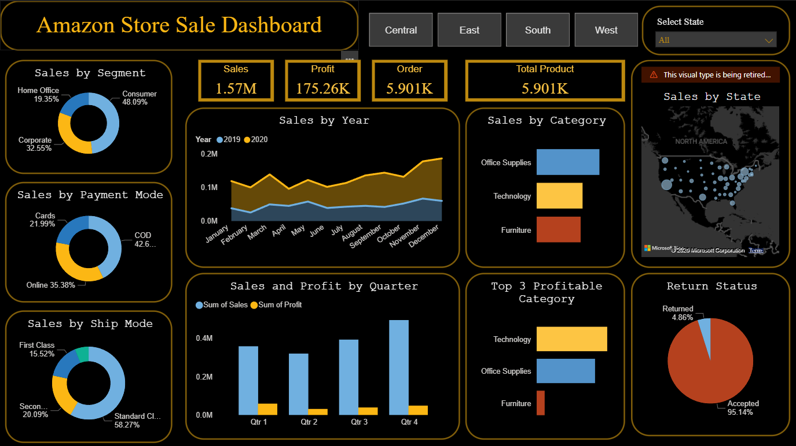

# 🛒 Amazon Sales Dashboard – Power BI

An interactive Power BI dashboard built using 5,900+ sales records to analyze revenue, profit, product performance, customer segments, and regional sales trends across the United States.

---

## 📊 Project Overview

The **Amazon Sales Dashboard** provides a comprehensive business intelligence solution to monitor:

- Total Sales
- Profit Performance
- Orders & Product Volume
- Regional Trends
- Category Insights
- Customer Segmentation
- Return Analysis

The dashboard enables stakeholders to make data-driven decisions by identifying profitable categories, regional demand patterns, and seasonal trends.

---

## 🧾 Dataset Information

- **Total Records:** 5,900+ sales transactions  
- **Data Includes:**
  - Order Date
  - Sales
  - Profit
  - Product Category
  - Customer Segment
  - Region & State
  - Payment Mode
  - Shipping Mode
  - Return Status

---

## 📌 Key Metrics (KPIs)

- 💰 **Total Sales:** 1.57M  
- 📈 **Total Profit:** 175.26K  
- 📦 **Total Orders:** 5,901  
- 🛍️ **Total Products Sold:** 5,901  

---

## 📊 Dashboard Features

### 1️⃣ Sales by Segment
- Consumer
- Corporate
- Home Office

### 2️⃣ Sales by Year
- Year-over-year comparison (2019 vs 2020)
- Monthly trend analysis

### 3️⃣ Sales by Category
- Office Supplies
- Technology
- Furniture

### 4️⃣ Sales & Profit by Quarter
- Quarterly sales performance
- Profit comparison

### 5️⃣ Sales by State (Map View)
- Geographic sales distribution
- Regional performance insights

### 6️⃣ Payment Mode Analysis
- COD
- Online
- Cards

### 7️⃣ Shipping Mode Analysis
- Standard Class
- Second Class
- First Class

### 8️⃣ Return Status
- Returned vs Accepted Orders

---

## 🛠 Tools & Technologies Used

- **Power BI Desktop**
- Data Modeling
- DAX (Data Analysis Expressions)
- Power Query (ETL)
- Data Visualization Best Practices

---

## 📈 Business Insights Generated

- Consumer segment contributes the highest sales share.
- Technology category generates the highest profit.
- Q4 shows the strongest sales performance.
- Majority of orders are successfully delivered (low return rate).
- Certain states outperform others significantly in revenue contribution.

---

## 📷 Dashboard Preview

---

## 🚀 How to Use

1. Download the `.pbix` file from this repository.
2. Open in **Power BI Desktop**.
3. Interact with filters (Region, State, Year).
4. Explore insights dynamically.

---

## 🎯 Project Objective

The goal of this project is to demonstrate:

- Data cleaning & transformation
- KPI development
- Data storytelling
- Interactive dashboard design
- Business performance analysis

